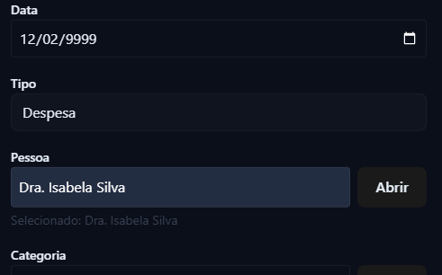

# BUG-02 - Informar data com ano inexistente quando cadastrar transacao

## 📌 Regra de Negócio Afetada

Datas de transações informada com valores inexistentes.

---

## 🎯 Severidade

Alta

---

## 🧪 Ambiente

- Backend: .NET
- Frontend: React

---

## 📖 Descrição

Podemos cadastrar despesa com data incorreta.

---

---

## ❌ Comportamento Atual

O sistema permite o cadastrar despesa com data errada.

---

## 📎 Evidência

Teste automatizado relacionado:

## 

