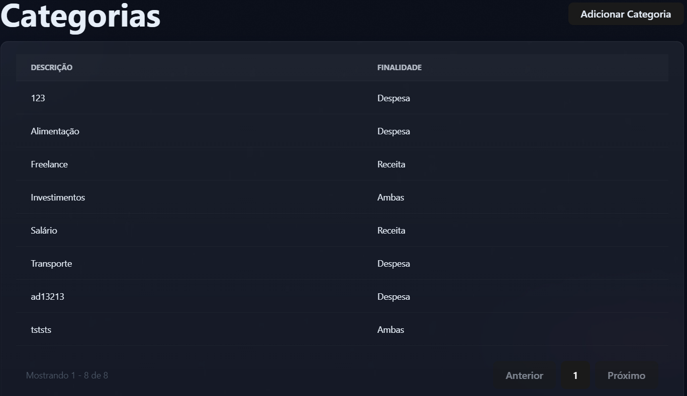

# BUG-02 - Não tem opção de remover categoria

## 📌 Regra de Negócio Afetada

Não conseguir remover categoria adicionadas.

---

## 🎯 Severidade

Alta

---

## 🧪 Ambiente

- Backend: .NET
- Frontend: React

---

## 📖 Descrição

Não podemos excluir uma categoria existente.

---

## ✅ Comportamento Esperado

O sistema pode deletar categoria adicionada.

---

## ❌ Comportamento Atual

O sistema não tem a opção de remover categoria ficando a opção permanente de categoria.

---

## 📎 Evidência

