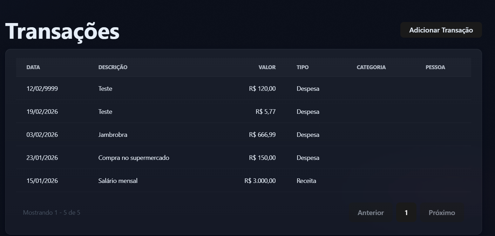

# BUG-05 - Não tem a opção de remover transação

## 📌 Regra de Negócio Afetada

Não conseguir remover transação que foram adicionadas.

---

## 🎯 Severidade

Alta

---

## 🧪 Ambiente

- Backend: .NET
- Frontend: React

---

## 📖 Descrição

Não podemos excluir uma transações existente.

---

## ✅ Comportamento Esperado

O sistema pode deletar transações adicionada.

---

## ❌ Comportamento Atual

O sistema não tem a opção de remover transações ficando a opção permanente de transações.

---

## 📎 Evidência

